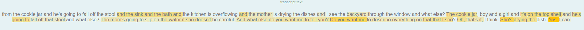

# Linguistic Explainability Framework

This repository offers a model-agnostic explainability framework for linguistic deep learning pipelines. It integrates human-interpretable techniques, such as SHAP (SHapley Additive exPlanations), to visualize linguistic cues associated with desired model outcomes (e.g., cognitive impairment). Additionally, it leverages state-of-the-art large language models (LLMs) to provide deeper interpretability and insights.

The framework also includes acoustic explainability. For more details, refer to the [Acoustic Explainability Framework repository](https://github.com/SpeechCARE/SpeechCARE_Acoustic_Explainability_Framework.git).

Below is a sample output of our linguistic explainability framework applied to a classification task from the [SpeechCARE challenge](https://github.com/SpeechCARE), where the subject's class was Mild Cognitive Impairment (MCI).



---

## ⚙️ Configuring `*.yml`

Before starting the training process, update the **`data/model_config.yml`** file with the appropriate paths and settings.

### ✅ Set Pretrained Checkpoints

Choose a pretrained acoustic transformer model by specifying its checkpoint in the configuration file. The pipeline supports various self-supervised speech models:

```yaml
txt_transformer_chp: "PATH/TO/PRETRAINED/MODEL/CHECKPOINTS"
```

### ✅ Set Training Hyperparameters

Change other training parameters or model configs like epoch, learning rate and etc.

---

## 🛠️ Usage

To use the provided explainability methods (SHAP) on an text input, you can run the `test_Shap.py` file using the following bash script. This script generates explanations for a given test sample and saves the results.

### Running the Script

Use the following command to run the `test_Shap.py` file:

```bash
!python SpeechCARE_Linguistic_Explainability_Framework/test/test_Shap.py --model_checkpoint $CHECKPOINTS_FILE \
                                                                  --transcription "$TRANSCRIPTION" \
                                                                  --predicted_label $PREDICTED_LABEL \
                                                                  --save_path $HTML_SAVE_PATH

```

### Arguments

- **`--model_checkpoint`**:  
  Path to the pretrained TBNet model weights. This file contains the trained model parameters required for inference.

- **`--transcription`**:  
  A string associated with the transcription to the sample's audio.

- **`--predicted_label`**:  
  A scalar value associated with the label predicted for the sample.

- **`--save_path`**:  
  Path to save the generated .html file with SHAP values visualized. This file highlights the parts of the text signal that the model attended to most.

---

## 🚀 Installation

You can install the required dependencies using the `requirements.txt` file:

```bash
pip install -r requirements.txt
```

---

## 📁 Repository Structure

```
├── data/                       # Contains necessary data
├── dataset/                    # Dataset architecture
├── Llama/                    # Contains methods to use Llama for interpreting the results
├── models/                      # Model architecture
├── utils/                      # Utility scripts for preprocessing and evaluation
├── test/                 # A sample script for using the explanation on text data
├── results_SHAP.ipynb                      # A notebook sample to show the output of the explanation method used
├── requirements.txt              # Dependencies for the project
```

---
